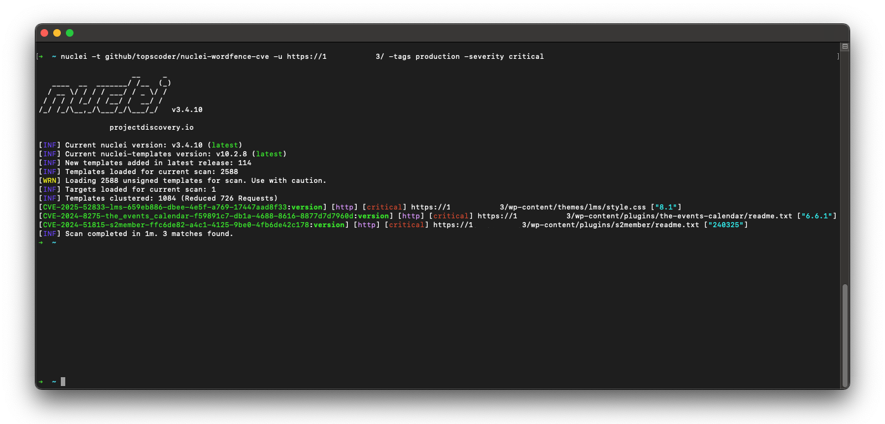

<div align="center">
  <a href="https://github.com/topscoder/nuclei-wordfence-cve">
    
  </a>
  <h1>Nuclei + Wordfence = ♥</h1>

  <h4><!-- START: __TOTAL_NUM_TEMPLATES -->65,000<!-- END: __TOTAL_NUM_TEMPLATES --> Nuclei Templates for WordPress Security Scanning 🥳</h4>  
   
   
   

</div>

<div align="center">

</div>

---

Level up your WordPress security game! This project's got a treasure trove of fresh [Nuclei](https://github.com/projectdiscovery/nuclei) templates for WordPress. Scan for weaknesses in Core, plugins, and themes – all based on the latest intel from [Wordfence.com](https://www.wordfence.com/threat-intel/vulnerabilities/).

Here's why this is your new best friend:

* **Massive collection**: No more hunting for individual templates, you've got a whole arsenal at your fingertips.
* **Always on point**: These templates stay updated with the freshest threats, so you're never behind the curve.
* **Open source magic**: Need to tweak a template for a specific situation? No problem, you've got full control.

If you're guarding a WordPress site, this project is your secret weapon to identify vulnerabilities before the bad guys do.  Stop wasting time and secure your sites like a pro!

---

> [!TIP]
> If you found this project helpful, please consider giving it a star on GitHub.
> Your support helps to make this project even better. 🌟

### ✨ What's in it?!

<!-- START: __STATISTICS_TABLE -->
<table width="100%">
  <tr>
    <td width="50%" valign="top">
      <table>
        <thead>
          <tr><th align="left">category</th><th align="left">total</th></tr>
        </thead>
        <tbody>
          <tr><td>wp-plugins</td><td><a href="https://github.com/search?q=%22wp-plugin%22+repo%3Atopscoder%2Fnuclei-wordfence-cve+language%3AYAML&type=code&ref=advsearch">60,620</a></td></tr>
          <tr><td>wp-themes</td><td><a href="https://github.com/search?q=%22wp-theme%22+repo%3Atopscoder%2Fnuclei-wordfence-cve+language%3AYAML&type=code&ref=advsearch">3,662</a></td></tr>
          <tr><td>wp-core</td><td><a href="https://github.com/search?q=%22wp-core%22+repo%3Atopscoder%2Fnuclei-wordfence-cve+language%3AYAML&type=code&ref=advsearch">724</a></td></tr>
          <tr><td>other</td><td><a href="https://github.com/search?q=repo%3Atopscoder%2Fnuclei-wordfence-cve+language%3AYAML++NOT+%22wp-plugin%22+NOT+%22wp-core%22+NOT+%22wp-theme%22+path%3A%2F%5Enuclei-templates%5C%2F%2F&type=code&ref=advsearch">0</a></td></tr>
        </tbody>
      </table>
    </td>
    <td width="50%" valign="top">
      <table>
        <thead>
          <tr><th align="left">severity</th><th align="left">total</th></tr>
        </thead>
        <tbody>
          <tr><td>critical</td><td><a href="https://github.com/search?q=severity%3A+critical+repo%3Atopscoder%2Fnuclei-wordfence-cve+language%3AYAML&type=code&ref=advsearch">5,228</a></td></tr>
          <tr><td>high</td><td><a href="https://github.com/search?q=severity%3A+high+repo%3Atopscoder%2Fnuclei-wordfence-cve+language%3AYAML&type=code&ref=advsearch">9,499</a></td></tr>
          <tr><td>medium</td><td><a href="https://github.com/search?q=severity%3A+medium+repo%3Atopscoder%2Fnuclei-wordfence-cve+language%3AYAML&type=code&ref=advsearch">20,572</a></td></tr>
          <tr><td>low</td><td><a href="https://github.com/search?q=severity%3A+low+repo%3Atopscoder%2Fnuclei-wordfence-cve+language%3AYAML&type=code&ref=advsearch">29,701</a></td></tr>
          <tr><td>info</td><td><a href="https://github.com/search?q=%22severity%3A+info%22+repo%3Atopscoder%2Fnuclei-wordfence-cve+language%3AYAML&type=code&ref=advsearch">0</a></td></tr>
        </tbody>
      </table>
    </td>
  </tr>
</table>
<!-- END: __STATISTICS_TABLE -->

## 🚀 Quick Start

To install this `nuclei-wordfence-cve` repository for use with Nuclei, you can use the following commands:

```bash
export GITHUB_TEMPLATE_REPO=topscoder/nuclei-wordfence-cve
nuclei -update-templates
```

Once you have installed this template repo using the commands above, you can run the following command to scan for vulnerabilities using Nuclei:

```bash
nuclei -t github/topscoder/nuclei-wordfence-cve -u https://target.com
```

Wordfence provides two separate feeds for vulnerabilities. The first feed includes only production vulnerabilities, each with an assigned CVE. The second feed contains candidate vulnerabilities, which do not yet have a CVE assigned and may or may not be promoted to the production feed. To differentiate templates generated from these feeds, a tag is assigned to each template—either production or candidate—allowing you to target them using a tag filter. Read more about the feeds at https://www.wordfence.com/help/wordfence-intelligence/v2-accessing-and-consuming-the-vulnerability-data-feed/

_Include only production templates:_
```bash
nuclei -t github/topscoder/nuclei-wordfence-cve -tags production -u https://target.com
```

_Include only candidate templates:_
```bash
nuclei -t github/topscoder/nuclei-wordfence-cve -tags candidate -u https://target.com
```

### 💻 Examples

Here are some examples how to use the templates:

* To scan for **all known vulnerabilities** in WordPress, you can run the following command:

```bash
nuclei -t github/topscoder/nuclei-wordfence-cve -u https://target.com
```

* To scan for a **CVE specific vulnerability**, you can run the following command:

```bash
nuclei -t github/topscoder/nuclei-wordfence-cve -template-id cve-2023-32961 -u https://target.com
```

* To scan only for **critical vulnerabilities**, you can run the following command:

```bash
nuclei -t github/topscoder/nuclei-wordfence-cve -severity critical -u https://target.com
```

* To scan only for **WordPress core vulnerabilities**, you can run the following command:

```bash
nuclei -t github/topscoder/nuclei-wordfence-cve -tags wp-core -u https://target.com
```

* To scan only for **WordPress plugin vulnerabilities**, you can run the following command:

```bash
nuclei -t github/topscoder/nuclei-wordfence-cve -tags wp-plugin -u https://target.com
```

* To scan only for **WordPress theme vulnerabilities**, you can run the following command:

```bash
nuclei -t github/topscoder/nuclei-wordfence-cve -tags wp-theme -u https://target.com
```

* To go wild, you can combine and combine and combine:

```bash
nuclei -t github/topscoder/nuclei-wordfence-cve -tags wp-plugin,wp-theme -severity critical,high
```

* To go even wilder, you can use the template condition flag (`-tc`) that allows complex expressions like the following ones:

```bash
nuclei -t github/topscoder/nuclei-wordfence-cve -template-condition "contains(to_lower(name),'cross-site scripting') || contains(to_upper(name),'XSS')" -u https://target.com

nuclei -t github/topscoder/nuclei-wordfence-cve -template-condition "contains(to_lower(name),'sql injection') || contains(to_lower(description),'sql injection')" -u https://target.com

nuclei -t github/topscoder/nuclei-wordfence-cve -template-condition "contains(to_lower(name),'file inclusion') || contains(to_lower(description),'file inclusion')" -u https://target.com

nuclei -t github/topscoder/nuclei-wordfence-cve -template-condition "contains(to_upper(name),'CSRF') || contains(to_upper(description),'CSRF')" -u https://target.com
```

## 🤖 Severity recalculation

Template severity is adjusted by the parser to better reflect real-world impact. The `determine_severity` function in `src/lib/wordfence_api_parser.py` inspects the vulnerability title and description and will downscale issues that are limited to authenticated users (e.g., require login or elevated roles).

Example (simplified):

- If the title or description contains the word `authenticated` (and not `unauthenticated`), the function treats the issue as lower risk and returns `Low` instead of a higher CVSS label.

This helps avoid assigning `Medium`/`High` severities to vulnerabilities that only affect logged-in users, which reduces noise when scanning publicly accessible sites.


## 👥 Contributing

If you would like to contribute to this project, please feel free to fork the repository and submit a pull request.
## 📚 License

This project is licensed under the MIT License.

> [!NOTE]
> ~~ Please use it responsibly!
